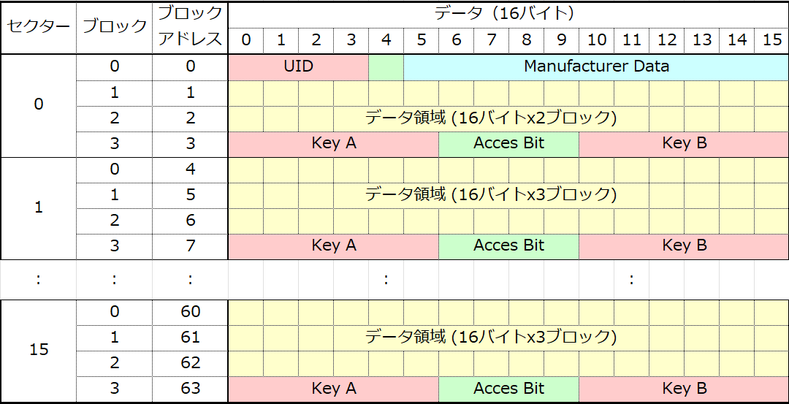

# NFCカードを簡単に読み書きするためのライブラリ

## これは何？
Mifare Classic と NTAG213 / NTAG215 / NTAG216 という2種類のNFCカードで、異なるメモリ構造の違いを意識することなく、1つの連続したメモリ空間として読み書きできる機能を提供します。NFCカードが持つプロテクト機能にも対応しています。

※本来MIFARE UltralightとNTAGは別物ですが、ここでは NTAG21xシリーズ のことを Ultralight と表記していますので読み替えてください。

## 対応するRFIDリーダー
* M5Stack [RFID 2 Unit (WS1850S)](https://shop.m5stack.com/products/rfid-unit-2-ws1850s)
* M5Stack [M5Stack Dial](https://shop.m5stack.com/products/m5stack-dial-v1-1) （※M5Stack Dialではコイン型のNFCタグは読めない）

## 対応するNFCカード
* Mifare Classic 1K
* NTAG213 (144byte)
* NTAG215 (504byte)
* NTAG216 (888byte)

## このライブラリの特徴
* byte型の配列や構造体を渡すだけで書き込みや読み込みができる
* パスワードによるプロテクトをかけられる

実際のNFCカードのメモリ空間は16または4バイト毎のブロックに分割されていて、管理用の領域を避けてデータを書き込まなくてはなりません。本ライブラリではユーザー領域を連結して、仮想的に連続したメモリ空間として扱えるので、メモリの何バイト目から書き込む、何バイト目から読み込むといった使い方ができます。

プロテクトをかけられるので、書き込んだデータを第三者に読まれないようにしたり、上書きされないようにすることもできます。

## 別途必要なライブラリ
[MFRC522_I2C](https://github.com/kkloesener/MFRC522_I2C) が必要です。Arduino IDEのライブラリマネージャーからインストールしてください。

## 本ライブラリで扱えるデータ空間
本ライブラリではデータ領域として使用できる部分のうちの一部を使用するため、表記のサイズよりも扱える容量は少なくなります。
* Mifare Classic 1K → 720バイトくらい
* NTAG213 144byte → 140バイトくらい
* NTAG215 504byte → 500バイトくらい
* NTAG216 888byte → 試してないので不明（たぶん884バイト）

## 仕様上の制限
このライブラリはNDEF Messageのルールには全く従っていません。元々設計上、他のデバイスと連携することは想定していないので独自形式で書き込んでいます。書き込んだNFCカードは別の用途で使えなくなる可能性もありますのでご注意ください。（おそらくformat()したあとにNFC Toolsなどで初期化すればいけると思いますが…）

壊れると困るNFCカードでは使用しないことをおすすめします。（超重要！）
<br /><br /><br />


# 基本的な使い方
NfcEasyWriter.h と NfcEasyWriter.cpp をカレントディレクトリにコピーしてご使用ください。

### 宣言
```cpp
#include "NfcEasyWriter.h"
MFRC522_I2C_Extend mfrc522(0x28, -1, &Wire);
NfcEasyWriter nfc(mfrc522);
```
mfrc522()の引数は、RFIDリーダーのI2Cアドレス、ダミー（使ってない）、Wireのインスタンス（省略可）を指定します。

### 初期化
```cpp
nfc.init();
nfc.debug = true;
```
シリアルにデバッグ情報を出力したい場合はnfc.debugをtrueにします。

### NFCカードのマウント
RFIDリーダーにカードが置かれて読み込める状態になるまで待ちます。以下は10秒すると抜けます。引数は0だと永遠に待ちます。
```cpp
bool result = nfc.mountCard(10000);
```
応用例：0.2秒ごとにチェックしてカードが置かれたらループを抜けます。
```cpp
Serial.print("カードを置いてください");
while (!nfc.mountCard(200)) {
  Serial.print(".");
}
Serial.println("\nカードを認識しました");
```
mountCard()の戻り値は、準備完了ならtrue、できなければfalseです。

### NFCカードのアンマウント
使用を終了するときや新しい別のNFCカードを扱うときは、アンマウントしてからマウントする必要があります。アンマウントすることで認識したカードの情報がクリアされます。
```cpp
nfc.unmountCard();
```

### データを書き込む
データを書き込むには、書き込む先頭の仮想アドレスとデータ（ポインター）を指定します。以下の例は仮想アドレスが0の位置からdataのデータを32バイト分書き込みます。
```cpp
uint16_t vaddr = 0;
byte data[32];
bool res = nfc.writeData(vaddr, data, sizeof(data));
```
仮想アドレスとは、NFCカードを1つのメモリ空間と考えたときの位置です。
書き込む先頭の仮想アドレスはClassicの場合は16の倍数、Ultralightの場合は4の倍数にする必要があります。それ以外の値を指定すると、writeData()はfalseを返します。ClassicとUltralightを区別なく扱いたい場合は、仮想アドレスを16の倍数（0, 16, 32,..）しておくと共通で使えて便利です。

### データを読み込む
データを書き込むには、読み込む先頭の仮想アドレスと格納先のデータ（ポインター）を指定します。
```cpp
uint16_t vaddr = 0;
byte data[32];
bool res = nfc.readData(vaddr, data, sizeof(data));
```

### 構造体の読み書き
構造体の場合は以下のようにします。
```cpp
struct NfcItem {  // 64 byte
  DataType type;
  uint16_t id;
  uint32_t price;
  char name[53];
};
NfcItem item = { DataType::ItemInfo, 1, 130, "Zunda Juice ずんだジュース" };
bool res = nfc.writeData(vindex, &item, sizeof(NfcItem));
```
```cpp
NfcItem item;
bool res = nfc.readData(vindex, &item, sizeof(NfcItem));
```
このように構造体のアドレスを与えれば、構造体の内容も簡単に書き込めます。
<br /><br /><br />


# よく使う関数
よく使う関数を紹介します。内部的に使っているものや、あまり使う機会のないものは [NfcEasyWriter.h](NfcEasyWriter) をご覧ください。プロテクト関連は後述します。
### 初期化
```cpp
void init();
```
RFIDリーダーを初期化します。

### カードをマウントする（読み書きできる状態になるまで待つ）
```cpp
bool mountCard(uint32_t timeout=0, ProtectMode mode=PRT_AUTO);
```
新しいカードを読み書きする前にマウントを実行します。タイムアウト値を指定すると、タイムアウト時間まで待ちます。

### カードのマウントを解除する
```cpp
void unmountCard();
```
別のカードに交換する場合や、プロテクトの状態を変更した場合は再マウントが必要です。

### カードがマウントされているか？（mountCard()が成功したか見てるだけ）
```cpp
bool isMounted();
```

### カードの種類 Mifare Classicか？ Mifare Ultralightか？
```cpp
bool isClassic();
bool isUltralight();
```
NFCカードをマウント後に、これらの関数でカードの種類をチェックできます。

### 使用可能な容量（仮想アドレス換算）を取得する
```cpp
uint16_t getVCapacities();
```
NFCカードをマウントすると容量を取得できるようになります。

### カードからデータを読み込む
```cpp
bool readData(uint16_t vaddr, void* data, size_t dataSize, ProtectMode mode=PRT_AUTO);    // 共通
```
byteの配列型を想定していますが、dataはポインターで与えるので、構造体のアドレスを渡すことも可能です。

### データをカードに書き込む
```cpp
bool writeData(uint16_t vaddr, void* data, size_t dataSize, ProtectMode mode=PRT_AUTO);    // 共通
```
byteの配列型を想定していますが、dataはポインターで与えるので、構造体のアドレスを渡すことも可能です。

### データ領域のフォーマット（NDEFメッセージを削除する）
```cpp
bool format(bool formatAll);
```
formatAll=trueにするとデータ領域全て（このライブラリがデータとして扱う範囲）を0でクリアします。falseにするとNDEFメッセージの先頭部分だけを無効な値にして、スマホでの誤動作を防ぎます。とりあえずfalseだけやっておけば十分です。

### ファームウェアバージョンのチェック
```cpp
bool firmwareVersionCheck();
```
どちらかというと、RFIDリーダーが接続されているか調べることが目的です。

### 全データをシリアルに出力する　デバッグ用
```cpp
void dumpAll(bool inProtect=false, uint8_t phySta=255, uint8_t phyEnd=255);
```
プロテクトがかかっていないNFCカードの場合は引数は不要です。
<br /><br /><br />


# プロテクト
NFCカードにはパスワード認証なしでの読み出しを禁止したり、パスワードがないと書き込めないようにする機能があります。セキュリティは高度ではないので簡易的な用途です。MIFARE Classicは脆弱性が発見されているので、高度なセキュリティが求められる用途には推薦されません。

## NFCカードの種類によるメモリ構造の違い
本ライブラリでは仮想アドレスでプロテクト範囲を指定できるので、違いを意識しなくてもおおむね使用できますが、プロテクト機能を扱うにはメモリ構造を知っておくと便利です。

### MIFARE Classic 1Kのメモリ構造


MIFARE Classic 1Kは16個のセクターがあり、1つのセクターには4つのブロックがあります。1ブロックは16バイトで構成されています。ブロックは0～2がユーザーが自由に書き込めるデータ領域になっており、ブロック3はパスワードや認証設定の領域です。各セクター毎にパスワードを設定できるようになっています。また先頭セクターのブロック0はUIDなどの特別な領域になっているので、書き込むことはできません。

本ライブラリでは面倒なのでセクター0は使わず、セクター1のブロック0から使用するようにしています。また、本ライブラリではパスワードの種類は1つのみとし、Key Aはデフォルト(FF)のまま使用します。Key Bをプロテクトのためのパスワードとして使用します。

### NTAG21x のメモリ構造


NTAG21x (Mifare Ultralight)は1ページが4バイトで構成されていて、製品によって何ページがあるかが異なります。NTAG213なら44ページまで、NTAG215なら134ページまでという感じです。厄介なのがデータ領域の後に設定やパスワードなどの領域がある点です。
本ライブラリではマウント時に容量の判定を行いますので、誤ってデータ領域を超えて書き込んでしまうことはたぶんないはずです。

Classicの場合はセクターごとにパスワードがありましたが、Ultralightは1種類しかありません。Classicでプロテクトをかける場合は「〇ページ以降をプロテクト」という形になります。

## プロテクトモードの種類
本ライブラリは以下のプロテクトモードがあります。デフォルトは PRT_NOPASS_RW です。
```cpp
enum ProtectMode : uint8_t {  // プロテクトモード
  PRT_AUTO,         // 最後にwriteProtect()設定した値　※これは明示的に使用するものではない
  PRT_NOPASS_RW,    // パスワード認証:なし、読み書き可  （KeyAで読み込み可 KeyAで書き込み可）
  PRT_NOPASS_RO,    // パスワード認証:なし、読み込み専用（KeyAで読み込み可 書き込み不可）
  PRT_PASSWD_RW,    // パスワード認証:あり、読み書き可  （KeyBで読み込み可 KeyBで書き込み可）
  PRT_PASSWD_RO,    // パスワード認証:あり、読み込み専用（KeyBで読み込み可 書き込み不可）
};
```
上記コメントはClassicの場合です。Ultralightでは挙動が違うので注意が必要です。

## Ultralightでのプロテクトの挙動
Ultralightでは PRT_NOPASS_RO モードはありません。Classicと供用で「読まれたくない」にしたいなら、PRT_PASSWD_RW モードを使うしかありません。

例：プロテクトをページ6に設定した場合
|条件|PRT_PASSWD_ROモード|PRT_PASSWD_RWモード|
|---|---|---|
|ページ5まで|〇読める<br>〇書ける|〇読める<br>〇書ける|
|ページ6以降<br>(認証なし)|〇読める<br>×書けない|×読めない<br>×書けない|
|ページ6以降<br>(認証あり)|〇読める<br>〇書ける|〇読める<br>〇書ける|

パスワード認証を行えば読み書き両方ともできてしまうので、Classicと挙動が違う点に注意が必要です。

## パスワードの長さ
パスワードは6バイト（48ビット）で指定します。Classicは6バイト全てがパスワードとして使用されますが、Ultralightは4バイトしかないため、先頭4バイトをパスワード(PWD)、後の2バイトを認証の応答確認用(PACK)に使用します。ライブラリを使用するうえでは意識する必要はありません。

## プロテクトの方法

### パスワード(認証キー)を設定する
使用するパスワードをインスタンスにセットします。単に設定しておくだけで、NFCには書き込みはしません。認証が必要になった際に使用するパスワードを設定しておくということです。
```cpp
AuthKey passwd = {{ 0xA1, 0xA2, 0xA3, 0xA4, 0xA5, 0xA6 }};
nfc.setAuthKey(&passwd);
```

### プロテクトモードにする
modeにプロテクトモード、keyに設定するパスワードを指定します。vaddrはプロテクトをかける先頭の仮想アドレスで、sizeはその範囲です。
```cpp
bool writeProtect(ProtectMode mode, AuthKey* key, uint16_t vaddr, int size, ProtectMode lastmode=PRT_AUTO);   // 共通
```
例：
```cpp
AuthKey passwd = {{ 0xA1, 0xA2, 0xA3, 0xA4, 0xA5, 0xA6 }};
uint16_t vaddr = 48;
int size = 13;
nfc.writeProtect(PRT_PASSWD_RW, &passwd, vaddr, size);
```
Classicの場合は指定した仮想アドレス(vaddr)の範囲にあるセクター(vaddr ～ vaddr+size-1)全てに書き込まれます。Ultralightの場合は仮想アドレス(vaddr)以降のページが対象になるので、sizeの値は無視されます。<br>
Classicの場合はvaddrは48バイト単位（0, 48, 96,..）にする必要があります。これは1セクターのユーザー領域が48バイトだからです。Ultralightの場合はvaddrは4バイト単位にする必要があります。ClassicとUltralightを共通で扱いたいならvaddrは48バイト単位にするといいでしょう。

### プロテクトモードを解除する
プロテクトモードを解除するには、同じ範囲を PRT_NOPASS_RW モードにするだけです。第5引数に現時点（解除前）のプロテクトモードを指定しています。これはプロテクトを解除するために認証が必要だからです。
```cpp
nfc.writeProtect(PRT_NOPASS_RW, nullptr, vaddr, size, PRT_PASSWD_RW); // Classic 仮想アドレス指定
```
Ultralightの場合はこれではだめです。Ultralightでプロテクトを無効にするには認証をかけるページを255（実際には存在しないが、これで事実上無しになる）にする必要があります。
```cpp
bool writeProtectUL(ProtectMode mode, AuthKey* key, uint16_t vaddr, bool phyaddr=false, ProtectMode lastmode=PRT_AUTO); // Ultralight
```
例：Ultralightの場合
```cpp
nfc.writeProtectUL(PRT_NOPASS_RW, nullptr, 255, true, PRT_PASSWD_RW);  // Ultralight 物理アドレス指定
```
phyaddrは指定したアドレスが物理pageの場合はtrueにします。なんかもうちょっとスマートにしたい感じですが、そう頻繁に使うものでないので…。

## 実践的なプログラム

### はじめてプロテクトを行う場合
NFCカードにプロテクトをかけたい場合は、はじめにNFCカードをプロテクトモードにします。
```cpp
byte wdata[13], rdata[13];   // データ
uint16_t vaddr = 48;  // 先頭アドレス
// NFCのマウント
nfc.mountCard(0);
// パスワードを設定する
AuthKey passwd = {{ 0xA1, 0xA2, 0xA3, 0xA4, 0xA5, 0xA6 }};  // パスワード
nfc.setAuthKey(&passwd);
// プロテクトを実施（NFCに書き込む）
nfc.writeProtect(PRT_PASSWD_RW, &passwd, vaddr, sizeof(wdata));
// NFCのアンマウント
nfc.unmountCard();
```
Classicの場合はwriteProtect()の後、続けて読み書きができます。Ultralightの場合はwriteProtect()の後、一旦アンマウントしてから再度マウントする必要があります。詳しくはサンプルをご覧ください。

### プロテクトがかかったNFCカードを読み書きする場合
すでにプロテクトがかかったNFCカードを読み書きして使用します。
```cpp
byte wdata[13], rdata[13];   // データ
uint16_t vaddr = 48;  // 先頭アドレス
// NFCのマウント
nfc.mountCard(0, PRT_PASSWD_RW);
// パスワードを設定する
AuthKey passwd = {{ 0xA1, 0xA2, 0xA3, 0xA4, 0xA5, 0xA6 }};  // パスワード
nfc.setAuthKey(&passwd);
// NFCにデータを書き込む
nfc.writeData(vaddr, wdata, sizeof(wdata), PRT_PASSWD_RW);
// NFCからデータを読み込む
nfc.readData(vaddr, rdata, sizeof(wdata), PRT_PASSWD_RW);
// NFCのアンマウント
nfc.unmountCard();
```
NFCカードのマウント時にプロテクトモード PRT_PASSWD_RW を指定しています。writeData()とreadData()の第4引数にプロテクトモードである PRT_PASSWD_RW を指定すると、認証を行って読み書きします。引数を省略した場合、mountCard()で設定したプロテクトモードが自動的に適用されます。省略はできますが、明示的に設定した方がいいでしょう。

### プロテクトがかかったNFCカードのプロテクトを解除する場合
プロテクトがかかったNFCカードのプロテクトを解除して、他のデバイスでも使用できるようにします。
```cpp
// NFCのマウント
nfc.mountCard(0, PRT_PASSWD_RW); 
// パスワードを設定する
AuthKey passwd = {{ 0xA1, 0xA2, 0xA3, 0xA4, 0xA5, 0xA6 }};  // パスワード
nfc.setAuthKey(&passwd);
// プロテクトを解除（NFCに書き込む）
if (nfc.isClassic()) {
  nfc.writeProtect(PRT_NOPASS_RW, nullptr, vaddr, sizeof(wdata), PRT_PASSWD_RW);  // 仮想アドレス指定
} else if (nfc.isUltralight()) {
  nfc.writeProtectUL(PRT_NOPASS_RW, nullptr, 255, true, PRT_PASSWD_RW);  // 物理アドレス指定
}
// NFCのアンマウント
nfc.unmountCard();
```
ClassicとUltralightでプロテクトの方法が違うため、Ultralightでは writeProtectUL() という関数を使用して、物理アドレスで範囲を指定しています。

このようにNFCの種類に応じて実際には
```cpp
writeProtect();   // 共通
writeProtectCL(); // Classic専用
writeProtectUL(); // Ultralight専用
```
のように3種類の関数があります。通常は共通のラッパー関数を使用し、固有の処理が必要な場合は専用関数を使います。
<br /><br /><br />


# サンプルプログラム
* [card_infomation.ino](example/card_infomation/card_infomation.ino) NFCカードの認識とカードの情報を出力
* [basic_write_read.ino](example/basic_write_read/basic_write_read.ino) 基本的な読み書き
* [dump_all.ino](example/dump_all/dump_all.ino) 全データのHEXダンプ
* [protected_write_read.ino](example/protected_write_read/protected_write_read.ino) プロテクトをかけた状態での読み書き
* [protected_write_read_missing.ino](example/protected_write_read_missing/protected_write_read_missing.ino) プロテクトがかかった状態で読み書きが失敗することを確認するテスト
* [full_test.ino](example/full_test/full_test.ino) (参考) 本ライブラリの開発に使用した動作テスト用
<br /><br /><br />


# 参考情報
こちらのページを参考にさせていただきました。超わかりやすいブログでおすすめです。
* https://logikara.blog/rfid/

データシート
* [MIFARE Classic 1K](https://orangetags.com/rfid-chip-datasheet/nxp-rfid-chip-datasheet/mifare/nxp-mifare-1k-datasheet/)
* [NTAG 213/215/216](https://www.nxp.jp/products/NTAG213_215_216)
* [MIFARE Classic NDEF format](https://www.nxp.com/docs/en/application-note/AN1305.pdf)

## 今後のメンテナンスについて
私はこのライブラリを今後もメンテナンスしていく予定はなく、作って終わりというスタンスです。気が向いたときは修正します。バグ修正や機能追加をされたい場合はすみませんが、フォークするかローカルで修正してご使用ください。
